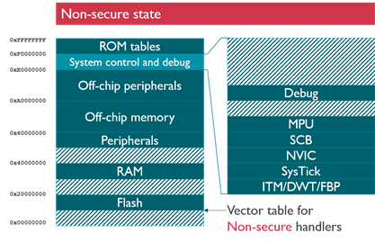
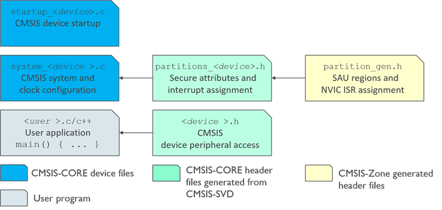

# Using TrustZone for Armv8-M {#using_TrustZone_pg}

[TOC]

The [TrustZone for Cortex-M](https://www.arm.com/technologies/trustzone-for-cortex-m) is a security extension for Armv8-M architecture that is optimized for ultra-low power embedded applications. It enables software security domains that restrict access to secure memory and I/O only for trusted software.

TrustZone for Armv8-M:

- preserves low interrupt latencies for both Secure and Non-secure domains.
- does not impose code overhead, cycle overhead or the complexity of a virtualization based solution.
- introduces the Secure Gateway (SG) processor instruction for calls to the secure domain.

**Notations**

This manual uses the following notations to identify functions and hardware resources that are related to TrustZone for Armv8-M:

 - prefix `TZ` or `__TZ` indicates a function that is available only in Armv8-M TrustZone enabled devices.
 - postfix `_NS` indicates a hardware resource that belongs to the Non-secure state.
 - postfix `_S` indicates a hardware resource that belongs to the Secure state.

## Simplified Use Case with TrustZone {#useCase_TrustZone}

An Armv8-M TrustZone enabled device has restricted access for data, code, and I/O access to trusted software that runs in the Secure state. Typical applications are secure IoT nodes, firmware IP protection, or multi-party embedded software deployments.

The figure **Simplified Use Case** shows and embedded application that is split into a **User Project** (executed in Non-secure state) and a **Firmware Project** (executed in Secure state).

 - **System Start:** after power on or reset, an Armv8-M system starts code execution in the **Secure state**. The access rights for the **Non-secure state** is configured.

 - **User Application:** control can be transferred to **Non-secure state** to execute user code. This code can only call functions in the **secure state** that are marked for execution with the **SG** (secure gate) instruction and memory attributes. Any attempt to access memory or peripherals that are assigned to the **Secure state** triggers a security exception.

 - **Firmware callbacks:** code running in the **Secure state** can execute code in the **Non-secure state** using call-back function pointers. For example, a communication stack (protected firmware) could use an I/O driver that is configured in user space.

\anchor SimpleUseCase

Program execution in the **Secure state** is further protected by TrustZone hardware from software failures.

For example, an Armv8-M system may implement two independent SYSTICK timers which allows to stop code execution in **Non-secure state** in case of timing violations. Also function pointer callbacks from **Secure state** to **Non-secure state** protected by a special CPU instruction and the address bit 0 which prevents anciently executing code in **Non-secure state**.

## Program Examples {#Example_TrustZone}

This [CMSIS-RTX](https://github.com/ARM-software/CMSIS-RTX) contains the following program examples that show the usage of TrustZone for Armv8-M on Cortex-M33 devices:

Example                                     | Description
:-------------------------------------------|:----------------
TrustZone for Armv8-M No RTOS               | bare-metal secure/non-secure programming without RTOS (shows the Simplified Use Case).
TrustZone for Armv8-M RTOS                  | secure/non-secure RTOS example with thread context management
TrustZone for Armv8-M RTOS Security Tests   | secure/non-secure RTOS example with security test cases and system recovery

Other sample application that reflects this <a href="#SimpleUseCase"><b>Simplified Use Case</b></a> is the **Armv8MBL Secure/Non-Secure example** that is available in the Software Pack **Keil - Arm V2M-MPS2 Board Support PACK for Cortex-M System Design Kit Devices** (Keil:V2M-MPS2_CMx_BSP.1.2.0.pack or higher).

## Programmers Model with TrustZone {#Model_TrustZone}

The figure <a href="#MemoryMap_S"><b>Secure Memory Map</b></a> shows the memory view for the **Secure state**. In the Secure state all memory and peripherals can be accessed. The **System Control and Debug** area provides access to secure peripherals and non-secure peripherals that are mirrored at a memory alias.

The secure peripherals are only accessible during program execution in **Secure state**. The Secure Attribute Unit (SAU) configures the non-secure memory, peripheral, and interrupt access. Also available are a secure MPU (memory protection unit), secure SCB (system control block), and secure SysTick timer.

The system supports two separate interrupt vector tables for secure and non-secure code execution.

This interrupt assignment is controlled during **Secure state** code execution via the NVIC (nested vector interrupt controller).

\anchor MemoryMap_S

The figure <a href="#MemoryMap_NS"><b>Non-Secure Memory Map</b></a> shows the memory view for the Non-secure state. This memory view is identical to the traditional Cortex-M memory map. Access to any secure memory or peripheral space triggers the secure exception that executes a handler in **Secure state**.

The \ref partition_h_pg defines the initial setup of the <a href="#MemoryMap_NS"><b>Non-Secure Memory Map</b></a> during system start in the Secure state (refer to functions \ref SystemInit and \ref TZ_SAU_Setup).

\anchor MemoryMap_NS

The figure **Registers** shows the register view of the Armv8-M system with TrustZone. As the general purpose registers are can be accessed from any state (secure or non-secure), function calls between the states use these registers for parameter and return values.

The register R13 is the stack pointer alias, and the actual stack pointer (PSP_NS, MSP_NS, PSP_S, MSP_S) accessed depends on state (Secure or Non-secure) and mode (handler=exception/interrupt execution or thread=normal code execution).

In Armv8-M Mainline, each stack pointer has a limit register (PSPLIM_NS, MSPLIM_NS, PSPLIM_S, MSPLIM_S) that traps stack overflows with the **UsageFault** exception (register UFSR bit STKOF=1).

An Armv8-M system with TrustZone has an independent **CONTROL** register for each state (Secure or Non-secure).

The interrupt/exception control registers (PRIMASK, FAULTMASK, BASEPRI) are banked between the states (Secure or Non-secure), however the interrupt priority for the Non-Secure state can be lowered (SCB_AIRCR register bit PRIS) so that secure interrupts have always higher priority.

The core registers of the current state (Secure or Non-secure) are accessed using the standard \ref Core_Register_gr functions. In Secure state all non-secure registers are accessible using the \ref coreregister_trustzone_functions related to TrustZone for Armv8-M.

## Stack Sealing {#RTOS_TrustZone_stacksealing}

CMSIS-Core \ref stacksealing_support_trustzone_functions provide standard interface for implementing the [Secure Stack Sealing technique](https://developer.arm.com/Arm%20Security%20Center/Armv8-M%20Stack%20Sealing%20Vulnerability) recommended for mitigating some security vulnerabilities on Armv8-M systems with TrustZone.

\ref startup_c_sec demonstrates how this functionality can be used in a device startup file.

Stack Sealing also requires an application project to have a linker script that explicitly reserves 8 bytes for the stack seal on top of the secure main stack. Linker files provided with \ref device_examples for Armv8-M cores demonstrate how this can be implemented. For example see .\\Device\\ARM\\ARMCM33\\Source\\ARM\\ARMCM33_ac6.sct.

To learn more about the stack sealing implementation in CMSIS projects for Armv8-M devices, refer to <a href="https://developer.arm.com/documentation/kan335" target="_blank"><b>Application Note 335</b></a>.

## CMSIS Files for TrustZone {#CMSIS_Files_TrustZone}

The CMSIS-Core files are extended by the header files \ref partition_h_pg and \ref partition_gen_h_pg :

 - The file \ref partition_h_pg "partition_<Device>.h" defines the initial system configuration and during SystemInit in Secure state.
 - The file \ref partition_gen_h_pg "partition_gen.h" is optional and contains SAU region and interrupt target assignments. This file may be generated using CMSIS-Zone.

> **Note**
> - Refer to \ref using_pg for a general description of the CMSIS-Core (Cortex-M) files.

## RTOS Thread Context Management {#RTOS_TrustZone}

To provide a consistent RTOS thread context management for Armv8-M TrustZone across the various real-time operating systems (RTOS), the CMSIS-Core (Cortex-M) includes header file **tz_context.h** with API definitions.

A *non-secure application* which uses an RTOS and calls *secure* library modules requires the management of the *secure* stack space. Since *secure state* registers cannot be accessed by the RTOS that runs in *non-secure state* secure functions implement the thread context switch.

As the *non-secure state* and *secure state* parts of an application are separated, the API for managing the *secure* stack space should be standardized. Otherwise the *secure* library modules would force the *non-secure state* application to use a matching RTOS implementation.

To allocate the context memory for threads, an RTOS kernel that runs in *non-secure state* calls the interface functions defined by the header file **tz_context.h**. The **TZ Context** functions themselves are part of the *secure state* application. An minimum implementation is provided as part of RTOS2 and should handle the secure stack for the thread execution. However it is also possible to implement the context memory management system with additional features such as access control to *secure state* memory regions using an MPU.

The API functions of **TZ Context** are described in the chapter [API Reference](modules.html) under \ref trustzone_functions - \ref context_trustzone_functions.

CMSIS-Core provides a template implementation of **TZ Contenxt** in `CMSIS\Core\Template\ARMv8-M\tz_context.c` file.

Refer to \ref Example_TrustZone for RTOS examples that demonstrate how to use the RTOS Thread Context Management.
