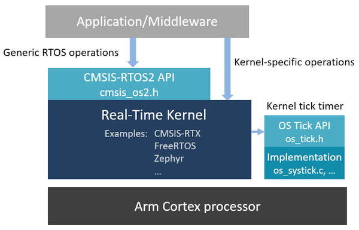

# Overview {#mainpage}

Modern embedded applications often need to concurrently execute multiple activities such as sensor readings, connectivity, machine-learning algorithms, graphics display and others. A real-time operating system (RTOS) equips users with necessary mechanisms that simplify implementation of complex programs and ensure their reliable operation with deterministic timing.

**CMSIS-RTOS2** specifies a generic RTOS interface over real-time OS kernels running on Arm&reg; Cortex&reg; processor-based devices. Applications and middleware components can \ref usingOS2 "use CMSIS_RTOS2 API" for better code reuse and simpler integration in various software ecosystems.

CMSIS-RTOS2 also specifies a standard \ref CMSIS_RTOS_TickAPI "OS Tick interface" for use by RTOS kernels. It provides several OS tick implementations for simple kernel porting to different Cortex-M and Cortex-A processors.

## Benefits {#rtos2_benefits}

CMSIS-RTOS2 provides great benefits to the embedded developers and software vendors:

 - The CMSIS-RTOS2 API covers all common services expected from a modern RTOS kernel for efficient thread management, inter-thread communication, timing control and others. See \ref rtos2_functionalities for details.
 - The unified API increases developers' productivity and reduces learning efforts. It makes the software components reusable across different software stacks.
 - The API enables use of advanced CPU features by RTOS and application, such as secure/non-secure execution with TrustZone, multi-core operation, access protection with MPU, and others.
 - The C interface is binary compliant with the [Application Binary Interface (ABI) for Arm architecture](https://github.com/ARM-software/abi-aa/) and enables inter-operation between various toolchains.
 - \ref rtosValidation "RTOS Validation Suite" provides a set of tests to verify compatibility to CMSIS-RTOS2 API definitions.
 - CMSIS-RTOS2 is well adopted by the industry, has many years of continuous improvements and commitment for future developments.

> **Note**
> - The CMSIS-RTOS2 defines a minimum feature set. It's architecture allows to use advanced vendor-specific features directly as well.

## Supported RTOS kernels {#rtos2_kernels}

Many popular RTOS kernels include support for CMSIS-RTOS2 API:

**CMSIS-RTX** (or Keil RTX5): provides most complete support for CMSIS-RTOS2 API and uses it as native interface. For more information see:

 - [CMSIS-RTX GitHub repository](https://github.com/ARM-software/CMSIS-RTX)
 - [CMSIS-RTX documentation](https://arm-software.github.io/CMSIS-RTX/)
 - [CMSIS-RTX pack](https://www.keil.arm.com/packs/cmsis-rtx-arm/versions/)

**FreeRTOS** : this popular RTOS kernel is enabled with CMSIS-RTOS2 API in the *CMSIS-FreeRTOS* variant. To learn more see:

 - [CMSIS-FreeRTOS GitHub repository](https://github.com/ARM-software/CMSIS-FreeRTOS)
 - [CMSIS-FreeRTOS documentation](https://arm-software.github.io/CMSIS-FreeRTOS/)
 - [CMSIS-FreeRTOS pack](https://www.keil.arm.com/packs/cmsis-freertos-arm/versions/)

**Zephyr RTOS**: is developed under governance of Linux Foundation and includes CMSIS-RTOS2 API support. See more at:

 - [Zephyr GitHub repository](https://github.com/zephyrproject-rtos/zephyr), see folder *subsys/portability/cmsis_rtos_v2/*
 - [Zephyr documentation about CMSIS-RTOS2 support](https://docs.zephyrproject.org/latest/services/portability/cmsis_rtos_v2.html)

**embOS**: is a preemptive RTOS designed by Segger, and provides support for CMSIS-RTOS2 API.

 - [Using embOS in CMSIS-Pack projects](https://wiki.segger.com/Using_embOS_in_CMSIS-Pack_projects)
 - [CMSIS-embOS pack](https://www.keil.arm.com/packs/cmsis-embos-segger/versions/)

**Azure ThreadX RTOS for STM32**: is an integration of Azure RTOS into STM32 middleware provided by STMicroelectronics.

 - [CMSIS-RTOS API support in ThreadX for STM32](https://wiki.st.com/stm32mcu/wiki/Introduction_to_THREADX#CMSIS-RTOS_API_Support)

**Micrium OS** is developed and maintained by Silicon Labs.

 - [Micrium OS overview and comparison](https://www.silabs.com/developers/rtos)

## Access to CMSIS-RTOS2 {#rtos2_access}

CMSIS-RTOS2 and OS Tick intefaces are actively maintained in the [**CMSIS 6 GitHub repository**](https://github.com/ARM-software/CMSIS_6) and provided as part of the [**CMSIS Software Pack**](../General/cmsis_pack.html).

The following files and directories relevant to CMSIS-RTOS2 are present in the **ARM::CMSIS** Pack:

File/Directory                        | Content
:-------------------------------------|:----------------------------------------------------
📂 CMSIS                              | CMSIS Base software components folder
 ┣ 📂 Documentation/html/RTOS2        | A local copy of this CMSIS-RTOS2 documentation
 ┗ 📂 RTOS2                           | CMSIS-RTOS2 API header files and OS tick implementations
&emsp;&nbsp; ┣ 📂 Include             | API header files
&emsp;&emsp;&nbsp; ┣ 📄 cmsis_os2.h    | \ref cmsis_os2_h
&emsp;&emsp;&nbsp; ┗ 📄 os_tick.h      | \ref CMSIS_RTOS_TickAPI header file
&emsp;&nbsp; ┗ 📂 Source               | OS tick implementations
&emsp;&emsp;&nbsp; ┣ 📄 os_systick.c   | OS tick implementation using Cortex-M SysTick timer
&emsp;&emsp;&nbsp; ┣ 📄 os_tick_gtim.c | OS tick implementation using Cortex-A Generic Timer
&emsp;&emsp;&nbsp; ┗ 📄 os_tick_ptim.c | OS tick implementation using Cortex-A Private Timer
