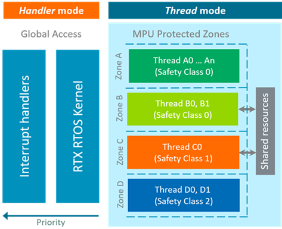
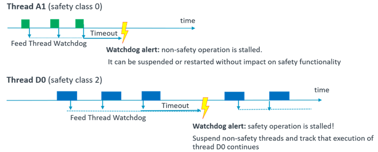

# Process Isolation {#CMSIS_RTOS_ProcessIsolation}

CMSIS-RTOS2 API supports a concept of **process isolation** that allows developers to protect execution of critical software tasks against potential flaws in other parts of a program.

Process Isolation in CMSIS-RTOS2 is enabled by following features:

 - \subpage rtos_process_isolation_mpu for memory access protection in the system using Memory Protection Unit (MPU).<br/>
    RTOS threads are executed with permission to access only memory regions and peripherals required for their operation. Hence thread code cannot accidentally modify critical RTOS kernel data or memory dedicated to other tasks.
 .
 - \subpage rtos_process_isolation_safety_class for access protection to RTOS objects via RTOS APIs.<br/>
    The RTOS objects with a higher safety class assigned to them cannot be modified via RTOS API functions from threads that have lower safety class assigned.
 .
 - \subpage rtos_process_isolation_thread_wdt to verify execution times of threads.<br/>
    Each thread can maintain own thread watchdog and in case of timing violations, corresponding thread watchdog alarm will be triggered.
 .
 - \subpage rtos_process_isolation_faults in case of a detected failure (for example thread watchdog alarm or MPU Fault).<br/>
    The RTOS provides functions to block execution of malfunctioning components and with that dedicate system resources for operation of the safety critical threads.

\if FuSaRTS
Section \ref fusa_process_isolation lists safety requirements for Process Isolation functions.
\endif

<!-- =============================================================== !-->
\page rtos_process_isolation_mpu MPU Protected Zones

Memory Protection Unit (MPU) is available on many Cortex-M devices and allows to execute code with restricted access to memory regions and peripherals. Detailed information about the MPU can be found in [Cortex-M Reference Manuals](../Core/index.html#ref_man_sec).

CMSIS-RTOS2 provides a concept of **MPU Protected Zones** as a simple and flexible mechanism for using MPUs with RTOS threads. MPU Protected Zones are defined by a user as a set of memory regions and peripherals with specified access rights, and each RTOS threads gets assigned to a specific MPU Protected Zone that it is allowed to use.

The figure below illustrates the concept for MPU Protected Zones for isolating threads.



Sections below explain in details how to define and use MPU Protected Zones:

 - \ref rtos_process_isolation_mpu_def
 - \ref rtos_process_isolation_mpu_load
 - \ref rtos_process_isolation_mpu_objects
 - \ref rtos_process_isolation_mpu_fault

**Function references**

Following functions implement and use MPU Protected Zone functionality:

 - \ref osThreadNew : \copybrief osThreadNew
 - \ref osThreadZone : \copybrief osThreadZone
 - \ref osThreadGetZone : \copybrief osThreadGetZone
 - \ref osThreadTerminateZone : \copybrief osThreadTerminateZone
 - \ref osZoneSetup_Callback : \copybrief osZoneSetup_Callback

## Define MPU Protected Zones {#rtos_process_isolation_mpu_def}

In the architectural design phase an application is logically split into functionalities with the same integrity level (same safety requirements). They can safely operate within the same MPU Protected Zone and hence access same memory areas and peripherals. 

MPU protected zones are defined in an MPU table where each row describes an individual MPU zone and each cell in the row specifies an MPU region within that zone. For details see section [MPU Functions](../Core/group__mpu__functions.html) in CMSIS-Core(M) documentation.

> **Note**
> - Interrupt handlers bypass the MPU protection. For this reason, it is required that potential impact of all interrupt handlers is strictly analyzed to exclude unintended memory accesses.

**Zone Identifier** (Zone ID) is used to refer to a specific MPU protected zone. Zone ID value equals to the row index (starting from 0) in the MPU table that describes corresponding MPU Protected Zone.

An MPU Protected Zone is assigned to one or more RTOS threads. This is done by providing the Zone ID value in thread attributes \ref osThreadAttr_t when creating the thread with the \ref osThreadNew function.

**Example:**

```c
/* ThreadA thread attributes */
const osThreadAttr_t thread_A_attr = {
  .name       = "ThreadA",       // human readable thread name
  .attr_bits  = osThreadZone(3U) // assign thread to MPU protected zone with Zone Id 3
};
osThreadNew(ThreadA, NULL, &thread_A_attr);
```

[CMSIS-Zone](../Zone/index.html) provides a utility that allows graphic configuration of MPU protected zones and generates MPU table in the CMSIS format.

## Load MPU Protected Zone {#rtos_process_isolation_mpu_load}

When switching threads the RTOS kernel compares Zone IDs of the currently running thread and the next thread to be executed. If the Zone Ids are different then a callback function \ref osZoneSetup_Callback is called. This callback function shall be implemented in the user application code to actually switch to the new MPU Protected Zone. In the function the user should load the MPU Protected Zone according to the Zone Id provided in the argument.

**Example:**

```c
/* Update MPU settings for newly activating Zone */
void osZoneSetup_Callback (uint32_t zone) {

  if (zone >= ZONES_NUM) {
    // Here issue an error for incorrect zone value
  }

  ARM_MPU_Load(mpu_table[zone], MPU_REGIONS);
}
```

## RTOS Objects and MPU Protection {#rtos_process_isolation_mpu_objects}

To access RTOS objects from the application RTOS APIs rely on a numeric `xxx_id` parameter associated with the object as explained in \ref rtos_objects. For example as `evt_flags` in this code:

```c
osEventFlagsId_t evt_flags;
evt_flags = osEventFlagsNew(NULL);
osEventFlagsSet(evt_flags, 1);
```

The allocation of an RTOS object to the memory in a specific MPU Protected Zone does not provide access restriction. The access restriction can be bypassed if another thread calls the CMSIS-RTOS2 API with the object ID of the RTOS object as argument. The CMSIS-RTOS2 function is executed in handler mode and therefore can access and modify the RTOS object without raising a Memory Fault.

To enable access control for RTOS objects the \ref rtos_process_isolation_safety_class concept is introduced in CMSIS-RTOS2.

## Handle Memory Access Faults {#rtos_process_isolation_mpu_fault}

A memory access fault is triggered when a thread tries to access memory or peripherals outside of the MPU Protected Zone loaded while the thread is running. In such case Memory Management Interrupt [MemoryManagement_IRQn](../Core/group__NVIC__gr.html) is triggered by the processor and its handling function is executed according to the exception vector table specified in the device startup file (by default \token{MemManage_Handler(void)} ).

The \e MemManage_Handler() interrupt handler is application specific and needs to be implemented by the user. In the handler it is possible to identify the thread that caused the memory access fault, the corresponding zone id and the safety class. This information can be used to define actions for entering a safe state. \ref rtos_process_isolation_faults provides more details on the available system recovery possibilities.

<!-- =============================================================== !-->
\page rtos_process_isolation_safety_class Safety Classes

\ref rtos_process_isolation_mpu_objects explains that MPU Protected Zones do not provide full access protection to RTOS objects accessed via CMSIS-RTOS2 API. The concept of a safety class fills this gap.

Every RTOS object, including thread is assigned with a numeric safety class value. A thread cannot modify an RTOS object if its safety class value is higher than the safety class value of the thread.
For example, it is not possible to change the priority or suspend a thread that has a higher safety class value than the thread that is currently executed.

**Function references**

 - Following functions and macros are used explicitly for managing safety classes:
   - \ref osSafetyClass : \copybrief osSafetyClass
   - \ref osThreadGetClass : \copybrief osThreadGetClass
   - \ref osSafetyWithSameClass : \copybrief osSafetyWithSameClass
   - \ref osSafetyWithLowerClass : \copybrief osSafetyWithLowerClass
   - \ref osKernelProtect : \copybrief osKernelProtect
   - \ref osThreadSuspendClass : \copybrief osThreadSuspendClass
   - \ref osThreadResumeClass : \copybrief osThreadResumeClass
   - \ref osKernelDestroyClass  : \copybrief osKernelDestroyClass
 - CMSIS-RTOS2 API functions that support safety class assignment when creating RTOS objects are listed in \ref rtos_process_isolation_safety_class_assign.
 - CMSIS-RTOS2 API functions that verify safety class assignment before execution are listed in \ref rtos_process_isolation_safety_class_error lists.

## Assign Safety Class to an RTOS Object {#rtos_process_isolation_safety_class_assign}

It is possible to create any objects regardless of the safety class after the kernel initialize with \ref osKernelInitialize, but before the kernel is started with \ref osKernelStart. This allows to setup a system before actually starting the RTOS kernel.

Threads of a higher safety class can create RTOS objects that belong to a lower or same safety class. For the object types listed below, the \e attr_bits can have an optional safety class value that is assigned when the RTOS object is created with the \e <i>os<Object>New</i> function. The macro \ref osSafetyClass encodes the value for the \e attr_bits field in the attr struct. For example:

```c
const osEventFlagsAttr_t evt_flags_attr = {
  .attr_bits = osSafetyClass(SAFETY_CLASS_SAFE_MODE_OPERATION)
};
osEventFlagsId_t evt_flags;
evt_flags = osEventFlagsNew(&evt_flags_attr);
```

The following object types support safety class assignment when creating an object with corresponding \e os<Object>New function:

 - \ref osThreadAttr_t \copybrief osThreadAttr_t Used in the \ref osThreadNew function.
 - \ref osEventFlagsAttr_t \copybrief  osEventFlagsAttr_t Used in the \ref osThreadNew function.
 - \ref osTimerAttr_t \copybrief osTimerAttr_t Used in the \ref osTimerNew function.
 - \ref osMutexAttr_t \copybrief osMutexAttr_t Used in the \ref osMutexNew function.
 - \ref osSemaphoreAttr_t \copybrief osSemaphoreAttr_t Used in the \ref osSemaphoreNew function.
 - \ref osMemoryPoolAttr_t \copybrief osMemoryPoolAttr_t Used in the \ref osMemoryPoolNew function.
 - \ref osMessageQueueAttr_t \copybrief osMessageQueueAttr_t Used in the \ref osMessageQueueNew function.

If safety class is not provided when creating the RTOS object then it inherits the safety class of the current running thread that creates the object. If the object is created before kernel is started and no safety class is provided, then it receives default safety class 0. This simplifies integration of third-party code that can be classified as non-safety critical.

## Handle Object Access Violation {#rtos_process_isolation_safety_class_error}

RTOS API call returns error code \ref osErrorSafetyClass if the requested object manipulation cannot be performed because the target object has higher safety class than the safety class of the running thread. For example:

```c
status = osEventFlagsSet(evt_flags, 1);
if (status == osErrorSafetyClass)
{
  //handle the safety class error
}
```

Following functions compare the safety class of the running thread with the safety class of the target object.

In \ref CMSIS_RTOS_KernelCtrl functions:

Comparison is done with safety class configured with \ref osKernelProtect

 - \ref osKernelLock
 - \ref osKernelRestoreLock
 - \ref osKernelSuspend
 - \ref osKernelProtect
 - \ref osKernelDestroyClass

In \ref CMSIS_RTOS_ThreadMgmt functions:

 - \ref osThreadNew
 - \ref osThreadSetPriority
 - \ref osThreadSuspend
 - \ref osThreadResume
 - \ref osThreadDetach
 - \ref osThreadJoin
 - \ref osThreadTerminate
 - \ref osThreadSuspendClass
 - \ref osThreadResumeClass

In \ref CMSIS_RTOS_ThreadFlagsMgmt functions:

 - \ref osThreadFlagsSet

In \ref CMSIS_RTOS_EventFlags functions:

 - \ref osEventFlagsNew
 - \ref osEventFlagsSet
 - \ref osEventFlagsClear
 - \ref osEventFlagsWait
 - \ref osEventFlagsDelete

In \ref CMSIS_RTOS_TimerMgmt functions:

 - \ref osTimerNew
 - \ref osTimerStart
 - \ref osTimerStop
 - \ref osTimerDelete

In \ref CMSIS_RTOS_MutexMgmt functions:

 - \ref osMutexNew
 - \ref osMutexAcquire
 - \ref osMutexDelete

In \ref CMSIS_RTOS_SemaphoreMgmt functions:

 - \ref osSemaphoreNew
 - \ref osSemaphoreAcquire
 - \ref osSemaphoreRelease
 - \ref osSemaphoreDelete

In \ref CMSIS_RTOS_PoolMgmt functions:

 - \ref osMemoryPoolNew
 - \ref osMemoryPoolAlloc
 - \ref osMemoryPoolFree
 - \ref osMemoryPoolDelete

In \ref CMSIS_RTOS_Message functions:

 - \ref osMessageQueueNew
 - \ref osMessageQueuePut
 - \ref osMessageQueueGet
 - \ref osMessageQueueReset
 - \ref osMessageQueueDelete

<!-- =============================================================== !-->
\page rtos_process_isolation_thread_wdt Thread Watchdogs

CMSIS-RTOS defines **Thread Watchdogs** that allow to control timing constraints for thread execution [temporal isolation](https://en.wikipedia.org/wiki/Temporal_isolation).

Each thread has an independent watchdog timer that is started with the function \ref osThreadFeedWatchdog(uint32_t ticks). The \token{ticks} value specifies the timeout before it expires.  Within this time interval the function \ref osThreadFeedWatchdog must be called again within the thread to restart the watchdog timer.

If the thread watchdog is not restarted during the specified amount of ticks the Watchdog Alarm  callback \ref osWatchdogAlarm_Handler(osThreadId_t thread_id) is triggered and can be used to recover the system or proceed to the system shutdown.

Figure below explains the concept with an example:



\ref rtos_process_isolation_faults provides more details on the available possibilities for system recovery.

> **Note**
> - If the application suspends a thread from scheduling by calling \ref osThreadSuspend or \ref osThreadSuspendClass, the thread watchdog still continues to run, and it is expected to expire and trigger \ref osWatchdogAlarm_Handler because the thread will not be serviced as expected.
> - Hence it may be necessary to differentiate handling of thread watchdogs that expired unexpectedly from the thread watchdog alarms of intentionally suspended threads.

**Function references**

Summary of functions that implement thread watchdog functionality:

 - \ref osThreadFeedWatchdog : \copybrief osThreadFeedWatchdog
 - \ref osWatchdogAlarm_Handler : \copybrief osWatchdogAlarm_Handler

<!-- =============================================================== !-->
\page rtos_process_isolation_faults Fault Handling

When a failure, or an error is detected in a system (for example \ref rtos_process_isolation_mpu_fault "memory access fault", \ref rtos_process_isolation_thread_wdt "thread watchdog alarm", or others) CMSIS-RTOS2 API allows to stop further execution of selected RTOS threads. This can be used to block malfunctioning components or free computing resources and so enable execution of the safety critical threads. 

Following approaches are available:

 - function \ref osThreadTerminateZone can be called in case of a fault exception. It will terminate all threads from the specified MPU Protected Zone (for example, can be the zone that has caused the fault). The function cannot be called in thread context or interrupts other than faults. Note that \ref osFaultResume can be called at the end of the handling code to return program execution into a known context and let kernel schedule the next thread ready for execution.
 - function \ref osThreadSuspendClass can be called in case of a thread watchdog alarm or other errors handled in thread context. It allows to suspend operation of threads based on the safety class assignment. Function \ref osThreadResumeClass can be used to resume operation of threads based on their safety class. \ref rtos_process_isolation_thread_wdt contains an example that demonstrates fault handling concept for thread watchdogs.

Function \ref osKernelDestroyClass fully removes RTOS objects of specific safety classes from the system. This can be useful to do before restarting operation of terminated or suspended threads.

**Function references**

Following CMSIS-RTOS2 functions and macros support fault handling:

 - \ref osThreadGetZone : \copybrief osThreadGetZone
 - \ref osThreadTerminateZone : \copybrief osThreadTerminateZone
 - \ref osThreadGetClass : \copybrief osThreadGetClass
 - \ref osSafetyWithSameClass : \copybrief osSafetyWithSameClass
 - \ref osSafetyWithLowerClass : \copybrief osSafetyWithLowerClass
 - \ref osThreadSuspendClass : \copybrief osThreadSuspendClass
 - \ref osThreadResumeClass : \copybrief osThreadResumeClass
 - \ref osKernelDestroyClass : \copybrief osKernelDestroyClass
 - \ref osFaultResume : \copybrief osFaultResume
 - \ref osWatchdogAlarm_Handler : \copybrief osFaultResume
