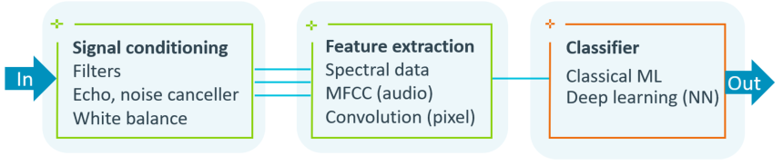

# CMSIS-Stream {#mainpage}

**CMSIS-Stream** is a Python package that provides methods, interfaces, and tools to optimize data block streaming between processing steps of a DSP/ML application.

## Access to CMSIS-Stream

 - [**CMSIS-Stream GitHub Repo**](https://github.com/ARM-software/cmsis-stream) - provides templates, usage examples, and access to documentation.
 - [**CMSIS-Stream Python package**](https://pypi.org/project/cmsis-stream/) - provides easy access to tools via standard Python delivery system.

## Benefits

 - CMSIS-Stream enables a modular design that makes it easier to develop and maintain DSP pipelines.
 - The provided tools generate at build time an optimized scheduling of the processing nodes with minimized memory overhead.
 - Creates an easy to understand representation of the design visualized with a compute graph.

## Components

The components of CMSIS-Stream are:

 - **Compute Graph** is the decomposition of the application in a directed graph that shows the data flow between processing nodes. It describes the data formats, FIFO buffers, data streams, and processing steps using a Python script file.
 - **Tools** convert the Compute Graph with Python into processing steps at build-time with optimized schedule and memory usage.
 - **Interfaces** header files, templates, and methods for data management (that works also on AMP systems).
 - **Usage Examples** that help a software developer to get started.

## Example Compute Graph

The diagram below shows a Compute Graph with four nodes:

 - A source generating 5 values in with data type `q15` each time it is run.
 - A processing node (Filter) consuming and producing 7 values with data type `q15` each time it is run.
 - A processing node (Detector) consuming 5 values with data type `q15` and producing 2 values with data type `f32` each it is run.
 - A sink consuming 10 values with data type `f32` each time it is run.

This Compute Graph is described with a Python script file that defines the nodes and their connections. This Python script computes a C++ implementation with static schedule and correctly sized memory buffers between each node. Nodes that are implemented in C are integrated using C++ wrappers.

## Complex DSP Pipelines

CMSIS-Stream gives the developer a toolbox that allows to create optimized DSP pipelines, that are for example required to optimize machine learning (ML) software stacks. With a Compute Graph complex DSP pipelines like shown in the diagram below can be described.

By optimizing signal conditioning and feature extraction, the complexity of the ML classifier. More DSP pre-processing helps therefore lowering the overall performance that is required for a ML application.

