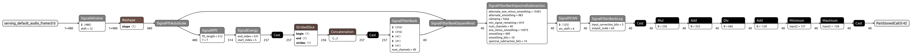
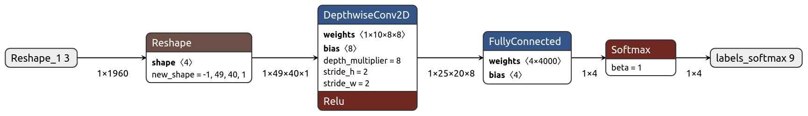

<!-- mdformat off(b/169948621#comment2) -->

# Micro Speech Example

This example shows how to run inference using TensorFlow Lite Micro (TFLM)
on two models for wake-word recognition.
The first model is an audio preprocessor that generates spectrogram data
from raw audio samples.
The second is the Micro Speech model, a less than 20 kB model
that can recognize 2 keywords, "yes" and "no", from speech data.
The Micro Speech model takes the spectrogram data as input and produces
category probabilities.


## Table of contents

-   [Audio Preprocessor](#audio-preprocessor)
-   [Micro Speech Model Architecture](#micro-speech-model-architecture)
-   [Run the C++ tests on a development machine](#run-the-c-tests-on-a-development-machine)
-   [Run the evaluate.py script on a development machine](#run-the-evaluatepy-script-on-a-development-machine)
-   [Run the evaluate_test.py script on a development machine](#run-the-evaluate_testpy-script-on-a-development-machine)
-   [Converting models or audio samples to C++](#converting-models-or-audio-samples-to-c)
-   [Train your own model](#train-your-own-model)

## Audio Preprocessor

The Audio Preprocessor model converts raw audio samples into a spectrographic feature.
Audio samples are input to the model in windowed frames, each window overlapping
the previous.  When sufficient features have been accumulated, those features can
be provided as input to the Micro Speech model.

This model provides a replication of the legacy preprocessing used during training
of the Micro Speech model.  For additional information on audio preprocessing during training,
please refer to the [training README](train/README.md#preprocessing-speech-input) documentation.

Audio Preprocessing models providing `int8` and `float32` output, ready for use
with the Micro Speech model, are provided in the [models](models/) directory.
These models expect the audio input to conform to:
* 30ms window frame
* 20ms window stride
* 16KHz sample rate
* 16-bit signed PCM data
* single channel (mono)

### Model Architecture

This model consists primarily of [Signal Library](https://github.com/tensorflow/tflite-micro/blob/main/python/tflite_micro/signal) operations.
The library is a set of Python methods, and bindings to `C++` library code.
To allow for use with the `TFLM MicroInterpreter`, a set of [Signal Library kernels](https://github.com/tensorflow/tflite-micro/blob/main/signal/micro/kernels)
is also provided.

The [audio_preprocessor.py](audio_preprocessor.py) script provides a complete example
of how to use the `Signal Library` within your own Python application.  This script
has support for TensorFlow eager-execution mode, graph-execution mode, and
`TFLM MicroInterpreter` inference operations.

[](images/audio_preprocessor_int8.png)

*This image was derived from visualizing the 'models/audio_preprocessor_int8.tflite' file in
[Netron](https://github.com/lutzroeder/netron)*

Each of the steps performed by the model are outlined as follows:
1) Audio frame input with shape `(1, 480)`
1) Apply `Hann Window` smoothing using `SignalWindow`
1) Reshape tensor to match the input of `SignalFftAutoScale`
1) Rescale tensor data using `SignalFftAutoScale` and calculate one of the input
parameters to `SignalFilterBankSquareRoot`
1) Compute FFT using `SignalRfft`
1) Compute power spectrum using `SignalEnergy`.  The tensor data is only updated
for elements between `[start_index, end_index)`.
1) The `Cast`, `StridedSlice`, and `Concatenation` operations are used to fill
the tensor data with zeros, for elements outside of `[start_index, end_index)`
1) Compress the power spectrum tensor data into just 40 channels (frequency bands)
using `SignalFilterBank`
1) Scale down the tensor data using `SignalFilterBankSquareRoot`
1) Apply noise reduction using `SignalFilterBankSpectralSubtraction`
1) Apply gain control using `SignalPCAN`
1) Scale down the tensor data using `SignalFilterBankLog`
1) The remaining operations perform additional legacy down-scaling and convert
the tensor data to `int8`
1) Model output has shape `(40,)`

### The `FeatureParams` Python Class

The `FeatureParams` class is located within the [audio_preprocessor.py](audio_preprocessor.py#L260)
script.  This class allows for custom configuration of the `AudioPreprocessor` class.
Parameters such as sample rate, window size, window stride, number of output channels,
and many more can be configured.  The parameters to be changed must be set during
class instantiation, and are frozen thereafter.  The defaults for `FeatureParams`
match those of the legacy audio preprocessing used during Micro Speech model training.

### The `AudioPreprocessor` Python Class

The `AudioPreprocessor` class in the [audio_preprocessor.py](audio_preprocessor.py#L338)
script provides easy to use convenience methods for creating
and using an audio preprocessing model.  This class is configured through use of
a `FeatureParams` object, allowing some flexibility in how the audio preprocessing
model works.

A short summary of the available methods and properties:
* `load_samples`: load audio samples from a `WAV` format file and prepare
the samples for use by other `AudioPreprocessor` methods
* `samples`: tensor containing previously loaded audio samples
* `params`: the `FeatureParams` object the class was instantiated with
* `generate_feature`: generate a single feature using TensorFlow eager-execution
* `generate_feature_using_graph`: generate a single feature using TensorFlow graph-execution
* `generate_feature_using_tflm`: generate a single feature using the `TFLM MicroInterpreter`
* `reset_tflm`: reset the internal state of the `TFLM MicroInterpreter` and the
`Signal Library` operations
* `generate_tflite_file`: create a `.tflite` format file for the preprocessor model

### Run the audio_preprocessor.py script on a development machine

The [audio_preprocessor.py](audio_preprocessor.py#L532) script generates a `.tflite`
file for the preprocessing model, ready for use with the Micro Speech model.

To generate a `.tflite` model file with `int8` output:
```bash
bazel build tensorflow/lite/micro/examples/micro_speech:audio_preprocessor
bazel-bin/tensorflow/lite/micro/examples/micro_speech/audio_preprocessor --output_type=int8
```

To generate a `.tflite` model file with `float32` output:
```bash
bazel build tensorflow/lite/micro/examples/micro_speech:audio_preprocessor
bazel-bin/tensorflow/lite/micro/examples/micro_speech/audio_preprocessor --output_type=float32
```

### Run the audio_preprocessor_test.py script on a development machine

The [audio_preprocessor_test.py](audio_preprocessor_test.py) script performs
several tests to ensure correct inference operations occur across all execution modes.
The tests are:
* cross-check inference results between eager, graph, and `TFLM MicroInterpreter`
execution modes
* check the `yes` and `no` 30ms samples in the [testdata](testdata/) directory for
correct generation of the feature tensor
* compare the preprocessor `int8` model against the same model in the [models](models/) directory
* compare the preprocessor `float32` model against the same model in the [models](models/) directory

```bash
bazel build tensorflow/lite/micro/examples/micro_speech:audio_preprocessor_test
bazel-bin/tensorflow/lite/micro/examples/micro_speech/audio_preprocessor_test
```

## Micro Speech Model Architecture

This is a simple model comprised of a Convolutional 2D layer, a Fully Connected
Layer or a MatMul Layer (output: logits) and a Softmax layer
(output: probabilities) as shown below. Refer to the [`tiny_conv`](https://github.com/tensorflow/tensorflow/blob/master/tensorflow/examples/speech_commands/models.py#L673)
model architecture. The output probabilities are in four categories:
`silence`, `unknown`, `yes`, `no`.

The input to the model is 49 spectrographic features, each feature
consisting of 40 channels of data.  The features are generated by the
Audio Preprocessor model.  For more information, please see the
[training README](train/README.md#preprocessing-speech-input) documentation.

[](images/micro_speech_quantized.png)

*This image was derived from visualizing the 'models/micro_speech_quantized.tflite' file in
[Netron](https://github.com/lutzroeder/netron)*

## Run the C++ tests on a development machine

To compile and test this example on a desktop Linux or macOS machine, download the
[TFLM source code](https://github.com/tensorflow/tflite-micro). Then switch
into the source directory from a terminal using the `cd` command.

Compile and run a native binary using Bazel:
```bash
bazel run tensorflow/lite/micro/examples/micro_speech:micro_speech_test
```

For a native binary using `make`, run the following command:
```bash
make -f tensorflow/lite/micro/tools/make/Makefile test_micro_speech_test
```

For an Arm Cortex-M0 binary running in the QEMU emulator:
```bash
make -f tensorflow/lite/micro/tools/make/Makefile TARGET=cortex_m_qemu TARGET_ARCH=cortex-m0 OPTIMIZED_KERNEL_DIR=cmsis_nn BUILD_TYPE=default test_micro_speech_test
```

This will take a few minutes, and downloads frameworks the code uses like
[CMSIS](https://developer.arm.com/embedded/cmsis) and
[flatbuffers](https://google.github.io/flatbuffers/). Once that process has
finished, you should see a series of files get compiled, followed by some
logging output from a test, which should conclude with `~~~ALL TESTS PASSED~~~`.

If you see this, it means that a small program has been built and executed that loads
the trained TensorFlow Lite model, runs some example inputs through it, and got the
expected outputs.

To understand how TFLM does this, you can look at the source in the
[micro_speech_test.cc](micro_speech_test.cc) file.
It's a fairly small amount of code that executes the following steps:
1) Create a `TFLM MicroInterpreter` with a handle to the Audio Preprocessor model
that has been compiled into the program
1) Repeatedly execute inference operations using `MicroInterpreter::invoke`,
with audio samples as input, and spectrogram features as output
1) Create a new `TFLM MicroInterpreter` with a handle to the Micro Speech model
that has been compiled into the program
1) Execute a single inference operation using `MicroInterpreter::invoke`,
with the spectrogram features as input, and category probabilities as output
1) Check the largest category probability for a match with the speech sample label.

## Run the evaluate.py script on a development machine
The [evaluate.py](evaluate.py#L166) script predicts the category of a single audio sample
given by the `sample_path` argument.  The output consists of the predictions for
the accumulated spectrogram features across (at most) 49 audio sample window frames.

```bash
bazel build tensorflow/lite/micro/examples/micro_speech:evaluate
bazel-bin/tensorflow/lite/micro/examples/micro_speech/evaluate --sample_path=tensorflow/lite/micro/examples/micro_speech/testdata/no_1000ms.wav
```

The output looks like this:
```bash
Frame #0: [0.0000, 0.0273, 0.0312, 0.9414]
Frame #1: [0.0000, 0.0273, 0.0312, 0.9414]
Frame #2: [0.0000, 0.0273, 0.0312, 0.9414]
Frame #3: [0.0000, 0.0273, 0.0273, 0.9414]
Frame #4: [0.0000, 0.0273, 0.0273, 0.9414]
Frame #5: [0.0000, 0.0273, 0.0273, 0.9414]
Frame #6: [0.0000, 0.0273, 0.0273, 0.9453]
Frame #7: [0.0000, 0.0273, 0.0273, 0.9453]
Frame #8: [0.0000, 0.0273, 0.0273, 0.9453]

...

Frame #40: [0.0000, 0.0312, 0.0000, 0.9648]
Frame #41: [0.0000, 0.0273, 0.0000, 0.9727]
Frame #42: [0.0000, 0.0312, 0.0000, 0.9688]
Frame #43: [0.0000, 0.0273, 0.0000, 0.9727]
Frame #44: [0.0000, 0.0273, 0.0000, 0.9727]
Frame #45: [0.0000, 0.0352, 0.0000, 0.9648]
Frame #46: [0.0000, 0.0391, 0.0000, 0.9609]
Frame #47: [0.0000, 0.0469, 0.0000, 0.9531]
Frame #48: [0.0000, 0.0547, 0.0000, 0.9453]
Model predicts the audio sample as <no> with probability 0.95
```

## Run the evaluate_test.py script on a development machine
The [evaluate_test.py](evaluate_test.py) script verifies the combination of the
Audio Preprocessor model and the Micro Speech model to generate correct inference results.
Four audio samples from the [testdata](testdata/) directory are used as input to
the Audio Preprocessor model.
The Audio Preprocessor model is tested with both `int8` and `float32` outputs.
The results of the audio preprocessing are then used to check predictions by the
Micro Speech model.

```bash
bazel build tensorflow/lite/micro/examples/micro_speech:evaluate_test
bazel-bin/tensorflow/lite/micro/examples/micro_speech/evaluate_test
```

## Converting models or audio samples to C++
A tool is available to convert your custom model or audio samples into `C++` data
structures that you can then use in your own wake-word application.
Keep in mind that audio samples for use with Audio Preprocessor and Micro Speech models
must be 1000ms in length, 16-bit PCM samples, and single channel (mono).
The tool can be found here: [generate_cc_arrays.py](../../tools/generate_cc_arrays.py)

The following commands show how to use the tool:
```bash
bazel build tensorflow/lite/micro/tools:generate_cc_arrays
bazel-bin/tensorflow/lite/micro/tools/generate_cc_arrays /tmp/data.cc path_to_custom_sample.wav
bazel-bin/tensorflow/lite/micro/tools/generate_cc_arrays /tmp/header.h path_to_custom_sample.wav
```

## Train your own model

So far you have used an existing trained model to run inference on
microcontrollers. If you wish to train your own model, follow the instructions
given in the [train](train/README.md) directory.
