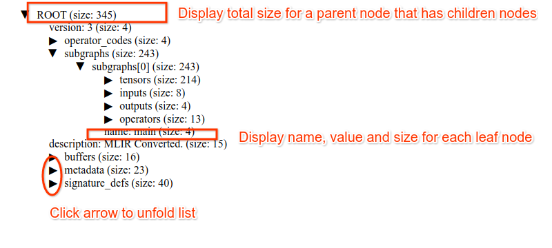

This is a experimental tool to generate a visualization of tflite file with size info for
each field. 

The size info of each field is the raw storage size info of each field without
any flatbuffer overhead such as the offset table etc. Hence, the size info
provide a lower bound on the size of data required (such as storing it into a c
struct) instead of storing it as the tflite buffer. 

Here is how you can use a visualization of tflite file

```
cd tensorflow/lite/micro/python/tflite_size/src

bazel run flatbuffer_size -- in_tflite_file out_html_file
```

A sample output html looks like this .

It displays each field's name, value and size. The display is composed of
collapsibly list so that you can zoom in/out individual structure based on need.

## How to update `schema_generated_with_reflective_type.h`

We generate our own schema_generated_with_reflective, using the build target in 
tensorflow/lite/schema:schema_fbs_with_reflection (call with: 
bazel build schema_fbs_with_reflection_srcs). 

