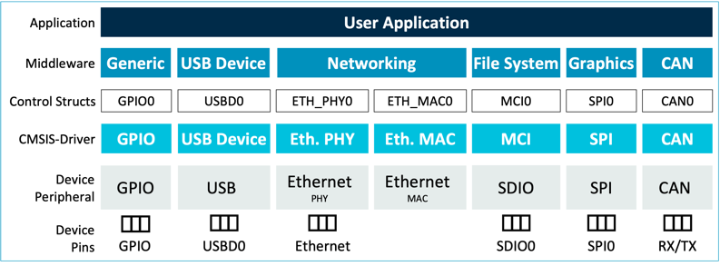

# Overview {#mainpage}

**CMSIS-Driver** specifies generic driver interfaces for peripherals commonly used in embedded systems with Arm® Cortex® processors.

User applications and middleware components can control such peripherals using the [**CMSIS-Driver API**](modules.html) and so achieve better code reuse and simpler integration in various ecosystems. The API is designed to be generic and independent of a specific RTOS making it reusable across a wide range of supported microcontroller devices.

The following block diagram shows an exemplary set up for various drivers.

The standard CMSIS-Driver interfaces connect microcontroller peripherals with middleware that implements communication stacks, file system and graphic user interfaces.

## Benefits {#cmsis_drv_benefits}

Using CMSIS-Driver provides great benefits to the embedded developers and software vendors:

 - The CMSIS-Driver API covers \ref cmsis_drv_interfaces "many common peripherals" present in modern embedded systems for sensor interaction, data storage, communication and graphics.
 - The unified API follows the similar design principles across all peripherals. This reduces learning efforts and increases developers' productivity. See \ref theoryOperation for details.
 - Driver templates files provide code sceletons that help to get started with implementations for specific peripherals. See \ref cmsis_driver_files.
 - Support for multiple driver instances with \ref AccessStruct.
 - \ref driverValidation "Driver-Validation Suite" provides a set of tests to verify compatibility to CMSIS-Driver API definitions.

## Covered Interfaces {#cmsis_drv_interfaces}

CMSIS-Driver APIs are defined for the following driver interfaces:

 - \ref can_interface_gr "CAN": Interface to CAN bus peripheral.
 - \ref eth_interface_gr "Ethernet": Interface to Ethernet MAC and PHY peripheral.
 - \ref i2c_interface_gr "I2C": Multi-master Serial Single-Ended Bus interface driver.
 - \ref mci_interface_gr "MCI": Memory Card Interface for SD/MMC memory.
 - \ref nand_interface_gr "NAND": NAND Flash Memory interface driver.
 - \ref flash_interface_gr "Flash": Flash Memory interface driver.
 - \ref sai_interface_gr "SAI": Serial audio interface driver (I2s, PCM, AC'97, TDM, MSB/LSB Justified).
 - \ref spi_interface_gr "SPI": Serial Peripheral Interface Bus driver.
 - \ref storage_interface_gr "Storage": Storage device interface driver.
 - \ref usart_interface_gr "USART": Universal Synchronous and Asynchronous Receiver/Transmitter interface driver.
 - \ref usb_interface_gr "USB": Interface driver for USB Host and USB Device communication.
 - \ref gpio_interface_gr "GPIO": General-purpose Input/Output driver.
 - \ref vio_interface_gr "VIO": API for virtual I/Os (VIO).
 - \ref wifi_interface_gr "WiFi": Interface driver for wireless communication.

A list of current CMSIS-Driver implementations is available \ref listOfImplementations "here".

## Access to CMSIS-Driver {#cmsis_driver_pack}

CMSIS-Driver intefaces are actively maintained in the [**CMSIS 6 GitHub repository**](https://github.com/ARM-software/CMSIS_6) and released as part of the [**CMSIS Software Pack**](../General/cmsis_pack.html).

The CMSIS Software Pack publishes the API Interface under the Component Class **CMSIS Driver** with header files and a documentation. These header files are the reference for the implementation of the standardized peripheral driver interfaces.

These implementations are published typically in the Device Family Pack of a related microcontroller family under the Component Class **CMSIS Driver**. A Device Family Pack may contain additional interfaces in the Component Class **Device** to extend the standard Peripheral Drivers covered by this CMSIS-Driver specification with additional device specific interfaces for example for Memory BUS, GPIO, or DMA.

The following directories and files relevant to CMSIS-Driver are present in the **ARM::CMSIS** Pack:

 Directory                        | Content
:---------------------------------|:------------------------------------------------------------------------
📂 CMSIS                          | CMSIS Base software components folder
 ┣ 📂 Documentation/html/Driver   | A local copy of this CMSIS-Driver documentation
 ┣ 📂 Driver                      | Directory with CMSIS-Driver component, see \ref cmsis_driver_files
&emsp;&nbsp; ┣ 📂 DriverTemplates | Driver Template files (Driver_<i>interface</i>.c)
&emsp;&nbsp; ┣ 📂 Include         | API header files (Driver_<i>interface</i>.h, %Driver_Common.h)
&emsp;&nbsp; ┗ 📂 VIO             | Implementation of virtual Input/Output interface (\ref vio_interface_gr)
