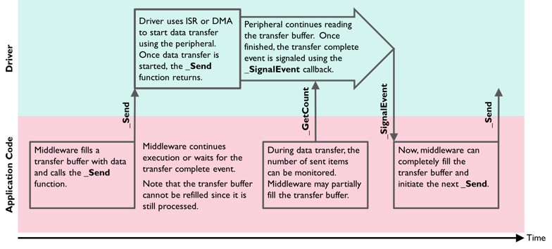

# Theory of Operation {#theoryOperation}

[TOC]

This section gives an overview of the general operation of CMSIS-Drivers. It explains the \ref DriverFunctions that are common in all CMSIS-Drivers along with the \ref CallSequence. The topic \ref Data_Xfer_Functions describes how data read/write operations to the peripheral are implemented.

Each CMSIS-Driver defines an \ref AccessStruct for calling the various driver functions and each peripheral (that is accessed via a CMSIS-Driver) has one \ref DriverInstances "Driver Instance".


## Common Driver Functions {#DriverFunctions}

Each CMSIS-Driver contains these functions:

 - `GetVersion`: can be called at any time to obtain version information of the driver interface.

 - `GetCapabilities`: can be called at any time to obtain capabilities of the driver interface.

 - `Initialize`: must be called before powering the peripheral using `PowerControl`. This function performs the following:
     - allocate I/O resources.
     - register an optional `SignalEvent` callback function.

 - `SignalEvent`: is an optional callback function that is registered with the `Initialize` function. This callback function is initiated from interrupt service routines and indicates hardware events or the completion of a data block transfer operation.

 - `PowerControl`: Controls the power profile of the peripheral and needs to be called after `Initialize`. Typically, three power options are available (see \ref ARM_POWER_STATE):
     - `ARM_POWER_FULL`: Peripheral is turned on and fully operational. The driver initializes the peripheral registers, interrupts, and (optionally) DMA.
     - `ARM_POWER_LOW` : (optional) Peripheral is in low power mode and partially operational; usually, it can detect external events and wake-up.
     - `ARM_POWER_OFF`: Peripheral is turned off and not operational (pending operations are terminated). This is the state after device reset.

 - `Uninitialize`: Complementary function to Initialize. Releases the I/O pin resources used by the interface.

 - `Control`: Several drivers provide a control function to configure communication parameters or execute miscellaneous control functions.

The section \ref CallSequence contains more information on the operation of each function. Additional functions are specific to each driver interface and are described in the individual sections of each driver.

## Cortex-M Processor Mode {#ProcessorMode}

The CMSIS-Driver functions access peripherals and interrupts and are designed to execute in **Privileged** mode. When calling CMSIS-Driver functions from RTOS threads, it should be ensure that these threads execute in **Privileged** mode.


## Function Call Sequence {#CallSequence}

For normal operation of the driver, the API functions `GetVersion`, `GetCapabilities`, `Initialize`, `PowerControl`, `Uninitialize` are called in the following order:

\msc
 a [label="", textcolor="indigo", linecolor="indigo", arclinecolor="indigo"],
 b [label="", textcolor="blue", linecolor="blue", arclinecolor="blue"];

 a rbox a [label="Middleware", linecolor="indigo"],
 b rbox b [label="Driver", linecolor="blue"];
 --- [label="Verify API version"];
 a=>b [label="GetVersion ()", textcolor="gray", linecolor="gray"];
 --- [label="Obtain driver features"];
 a=>b [label="GetCapabilities (...)", textcolor="gray", linecolor="gray"];
 ---  [label="Setup software resources"];
 a=>b [label="Initialize (...)", textcolor="red", linecolor="red"];
 --- [label="Setup the peripheral"];
 a=>b  [label="PowerControl (ARM_POWER_FULL)", textcolor="red", linecolor="red"];
 --- [label="Operate with the peripheral"];
 a=>b [label="Data Transfer Functions"];
 a<=b  [label="SignalEvent (...)"];
 --- [label="Wait for external hardware events"];
 a=>b  [label="PowerControl (ARM_POWER_LOW)"];
 a<=b  [label="SignalEvent (...)"];
 --- [label="Stop working with peripheral"];
 a=>b [label="PowerControl (ARM_POWER_OFF)", textcolor="red", linecolor="red"];
 a=>b [label="Uninitialize (...)", textcolor="red", linecolor="red"];
\endmsc

The functions `GetVersion` and `GetCapabilities` can be called any time to obtain the required information from the driver. These functions return always the same information.


### Start Sequence {#CS_start}

To start working with a peripheral the functions `Initialize` and `PowerControl` need to be called in this order:

```c
  drv->Initialize (...);                 // Allocate I/O pins
  drv->PowerControl (ARM_POWER_FULL);    // Power up peripheral, setup IRQ/DMA
```

 - `Initialize` typically allocates the I/O resources (pins) for the peripheral. The function can be called multiple times; if the I/O resources are already initialized it performs no operation and just returns with \ref ARM_DRIVER_OK.
 - `PowerControl` (`ARM_POWER_FULL`) sets the peripheral registers including interrupt (NVIC) and optionally DMA. The function can be called multiple times; if the registers are already set it performs no operation and just returns with \ref ARM_DRIVER_OK.

### Stop Sequence {#CS_stop}

To stop working with a peripheral the functions `PowerControl` and `Uninitialize` need to be called in this order:

```c
  drv->PowerControl (ARM_POWER_OFF);     // Terminate any pending transfers, reset IRQ/DMA, power off peripheral
  drv->Uninitialize (...);               // Release I/O pins
```

The functions `PowerControl` and `Uninitialize` always execute and can be used to put the peripheral into a **Safe State**, for example after any data transmission errors.  To restart the peripheral in a error condition, you should first execute the \ref CS_stop and then the \ref CS_start.

 - `PowerControl` (`ARM_POWER_OFF`) terminates any pending data transfers with the peripheral, disables the peripheral and leaves it in a defined mode (typically the reset state).
    - when DMA is used it is disabled (including the interrupts)
    - peripheral interrupts are disabled on NVIC level
    - the peripheral is reset using a dedicated reset mechanism (if available) or by clearing the peripheral registers
    - pending peripheral interrupts are cleared on NVIC level
    - driver variables are cleared
 - `Uninitialize` always releases I/O pin resources.

##  Shared I/O Pins {#Share_IO}

All CMSIS-Driver provide a \ref CS_start and \ref CS_stop. Therefore two different drivers can share the same I/O pins, for example UART1 and SPI1 can have overlapping I/O pins. In this case the communication channels can be used as shown below:

```c
  SPI1drv->Initialize (...);                // Start SPI1
  SPI1drv->PowerControl (ARM_POWER_FULL);
   ...                                      // Do operations with SPI1
  SPI1drv->PowerControl (ARM_POWER_OFF);    // Stop SPI1
  SPI1drv->Uninitialize ();
   ...
  USART1drv->Initialize (...);              // Start USART1
  USART1drv->PowerControl (ARM_POWER_FULL);
   ...                                      // Do operations with USART1
  USART1drv->PowerControl (ARM_POWER_OFF);  // Stop USART1
  USART1drv->Uninitialize ();
```

## Data Transfer Functions {#Data_Xfer_Functions}

A CMSIS-Driver implements non-blocking functions to transfer data to a peripheral. This means that the driver configures the read or write access to the peripheral and instantly returns to the calling application. The function names for data transfer end with:

 - `Send` to write data to a peripheral.
 - `Receive` to read data from a peripheral.
 - `Transfer` to indicate combined read/write operations to a peripheral.

During a data transfer, the application can query the number of transferred data items using functions named <b>Get<i>xxx</i>Count</b>. On completion of a data transfer, the driver calls a callback function with a specific event code.

During the data exchange with the peripheral, the application can decide to:

 - Wait (using an RTOS scheduler) for the callback completion event. The RTOS is controlled by the application code which makes the driver itself RTOS independent.
 - Use polling functions that return the number of transferred data items to show progress information or partly read or fill data transfer buffers.
 - Prepare another data transfer buffer for the next data transfer.

The following diagram shows the basic communication flow when using the `_Send` function in an application.



## Access Struct {#AccessStruct}

A CMSIS-Driver publishes an \ref AccessStruct with the data type name `ARM_DRIVER_xxxx` that gives to access the driver functions.

**Code Example:** Function Access of the SPI driver

```c
typedef struct _ARM_DRIVER_SPI {
  ARM_DRIVER_VERSION   (*GetVersion)      (void);
  ARM_SPI_CAPABILITIES (*GetCapabilities) (void);
  int32_t              (*Initialize)      (ARM_SPI_SignalEvent_t cb_event);
  int32_t              (*Uninitialize)    (void);
  int32_t              (*PowerControl)    (ARM_POWER_STATE state);
  int32_t              (*Send)            (const void *data, uint32_t num);
  int32_t              (*Receive)         (      void *data, uint32_t num);
  int32_t              (*Transfer)        (const void *data_out, void *data_in, uint32_t num);
  uint32_t             (*GetDataCount)    (void);
  int32_t              (*Control)         (uint32_t control, uint32_t arg);
  ARM_SPI_STATUS       (*GetStatus)       (void);
} const ARM_DRIVER_SPI;
```

### Driver Instances {#DriverInstances}

A device may offer several peripherals of the same type. For such devices, the CMSIS-Driver publishes multiple instances of the \ref AccessStruct. The name of each driver instance reflects the names of the peripheral available in the device.

**Code Example:** \ref AccessStruct for three SPIs in a microcontroller device.

```c
ARM_DRIVER_SPI Driver_SPI1;     // access functions for SPI1 interface
ARM_DRIVER_SPI Driver_SPI2;     // access functions for SPI2 interface
ARM_DRIVER_SPI Driver_SPI3;     // access functions for SPI3 interface
```

The access functions can be passed to middleware to specify the driver instance that the middleware should use for communication.

**Naming Convention**

The access structs need to follow this naming convention: the keyword `Driver` followed by an underscore `_`, the interface name `IFNAME` (usually in upper case letters), and the instance number `n`. Here's the full list of access struct names for all drivers (n to be replaced with the actual instance number):

```c
Driver_CANn
Driver_ETH_MACn
Driver_ETH_PHYn
Driver_Flashn
Driver_GPIOn
Driver_I2Cn
Driver_MCIn
Driver_NANDn
Driver_SAIn
Driver_SPIn
Driver_Storagen
Driver_USARTn
Driver_USBDn
Driver_USBHn
Driver_WiFin
```


**Example:**

```c
void init_middleware (ARM_DRIVER_SPI *Drv_spi) ...
\\ inside the middleware the SPI driver functions are called with:
\\   Drv_spi->function (...);
```

```c
\\ setup middleware
init_middleware (&Driver_SPI1);      // connect middleware to SPI1 interface
  :
init_middleware (&Driver_SPI2);      // connect middleware to SPI2 interface
```

## CMSIS-Driver Files {#cmsis_driver_files}

The API of each CMSIS-Driver peripheral is published in a corresponding header file in the directory `.\CMSIS\Driver\Include\` It is recommended to include such header file in the implementation file of the CMSIS-Driver.

Template files are available to simplify the development of a CMSIS-Driver. These are code skeletons that provide the structure of a CMSIS-Driver. They are available in the directory`.\CMSIS\Driver\DriverTemplates\`. You can also refer to working \ref listOfImplementations "CMSIS-Driver Implementations" to see how CMSIS-Drivers get implemented on real devices.

The table below summarizes the API header and template files for CMSIS-Driver interfaces, with links to GitHub and API references.


| Header File          | Template File            | API Reference
:----------------------|:-------------------------|:-----------------------
[Driver_Common.h](https://github.com/ARM-software/CMSIS_6/blob/main/CMSIS/Driver/Include/Driver_Common.h)| Not applicable | \ref common_drv_gr
[Driver_CAN.h](https://github.com/ARM-software/CMSIS_6/blob/main/CMSIS/Driver/Include/Driver_CAN.h)      | [Driver_CAN.c](https://github.com/ARM-software/CMSIS_6/blob/main/CMSIS/Driver/DriverTemplates/Driver_CAN.c) |\ref can_interface_gr
[Driver_ETH.h](https://github.com/ARM-software/CMSIS_6/blob/main/CMSIS/Driver/Include/Driver_ETH.h)      | - |\ref eth_interface_gr
[Driver_ETH_MAC.h](https://github.com/ARM-software/CMSIS_6/blob/main/CMSIS/Driver/Include/Driver_ETH_MAC.h)  | [Driver_ETH_MAC.c](https://github.com/ARM-software/CMSIS_6/blob/main/CMSIS/Driver/DriverTemplates/Driver_ETH_MAC.c) | \ref eth_mac_interface_gr
[Driver_ETH_PHY.h](https://github.com/ARM-software/CMSIS_6/blob/main/CMSIS/Driver/Include/Driver_ETH_MAC.h)  | [Driver_ETH_PHY.c](https://github.com/ARM-software/CMSIS_6/blob/main/CMSIS/Driver/DriverTemplates/Driver_ETH_PHY.c) | \ref eth_phy_interface_gr
[Driver_Flash.h](https://github.com/ARM-software/CMSIS_6/blob/main/CMSIS/Driver/Include/Driver_Flash.h)  | [Driver_Flash.c](https://github.com/ARM-software/CMSIS_6/blob/main/CMSIS/Driver/DriverTemplates/Driver_Flash.c) | \ref flash_interface_gr
[Driver_GPIO.h](https://github.com/ARM-software/CMSIS_6/blob/main/CMSIS/Driver/Include/Driver_GPIO.h)  | [Driver_GPIO.c](https://github.com/ARM-software/CMSIS_6/blob/main/CMSIS/Driver/DriverTemplates/Driver_GPIO.c) | \ref gpio_interface_gr
[Driver_I2C.h](https://github.com/ARM-software/CMSIS_6/blob/main/CMSIS/Driver/Include/Driver_I2C.h)  | [Driver_I2C.c](https://github.com/ARM-software/CMSIS_6/blob/main/CMSIS/Driver/DriverTemplates/Driver_I2C.c) | \ref i2c_interface_gr
[Driver_MCI.h](https://github.com/ARM-software/CMSIS_6/blob/main/CMSIS/Driver/Include/Driver_MCI.h)  | [Driver_MCI.c](https://github.com/ARM-software/CMSIS_6/blob/main/CMSIS/Driver/DriverTemplates/Driver_MCI.c) | \ref mci_interface_gr
[Driver_NAND.h](https://github.com/ARM-software/CMSIS_6/blob/main/CMSIS/Driver/Include/Driver_NAND.h)  | [Driver_NAND.c](https://github.com/ARM-software/CMSIS_6/blob/main/CMSIS/Driver/DriverTemplates/Driver_NAND.c) | \ref nand_interface_gr
[Driver_SAI.h](https://github.com/ARM-software/CMSIS_6/blob/main/CMSIS/Driver/Include/Driver_SAI.h)  | [Driver_SAI.c](https://github.com/ARM-software/CMSIS_6/blob/main/CMSIS/Driver/DriverTemplates/Driver_SAI.c) | \ref sai_interface_gr
[Driver_SPI.h](https://github.com/ARM-software/CMSIS_6/blob/main/CMSIS/Driver/Include/Driver_SPI.h)  | [Driver_SPI.c](https://github.com/ARM-software/CMSIS_6/blob/main/CMSIS/Driver/DriverTemplates/Driver_SPI.c) | \ref spi_interface_gr
[Driver_Storage.h](https://github.com/ARM-software/CMSIS_6/blob/main/CMSIS/Driver/Include/Driver_Storage.h)  | [Driver_Storage.c](https://github.com/ARM-software/CMSIS_6/blob/main/CMSIS/Driver/DriverTemplates/Driver_Storage.c) | \ref storage_interface_gr
[Driver_USART.h](https://github.com/ARM-software/CMSIS_6/blob/main/CMSIS/Driver/Include/Driver_USART.h)  | [Driver_USART.c](https://github.com/ARM-software/CMSIS_6/blob/main/CMSIS/Driver/DriverTemplates/Driver_USART.c) | \ref usart_interface_gr
[Driver_USB.h](https://github.com/ARM-software/CMSIS_6/blob/main/CMSIS/Driver/Include/Driver_USB.h)  | - | \ref usb_interface_gr
[Driver_USBD.h](https://github.com/ARM-software/CMSIS_6/blob/main/CMSIS/Driver/Include/Driver_USBD.h)  | [Driver_USBD.c](https://github.com/ARM-software/CMSIS_6/blob/main/CMSIS/Driver/DriverTemplates/Driver_USBD.c) | \ref usbd_interface_gr
[Driver_USBH.h](https://github.com/ARM-software/CMSIS_6/blob/main/CMSIS/Driver/Include/Driver_USBH.h)  | [Driver_USBH.c](https://github.com/ARM-software/CMSIS_6/blob/main/CMSIS/Driver/DriverTemplates/Driver_USBH.c) | \ref usbh_interface_gr
[Driver_WiFi.h](https://github.com/ARM-software/CMSIS_6/blob/main/CMSIS/Driver/Include/Driver_WiFi.h)  | [Driver_WiFi.c](https://github.com/ARM-software/CMSIS_6/blob/main/CMSIS/Driver/DriverTemplates/Driver_WiFi.c) | \ref wifi_interface_gr

## Driver Configuration {#DriverConfiguration}

For a device family, the drivers may be configurable, but the configuration of the drivers itself is not part of the CMSIS-Driver specification.

## Code Example {#CodeExample}

The following example code shows the usage of the SPI interface.

\include SPI_Demo.c
