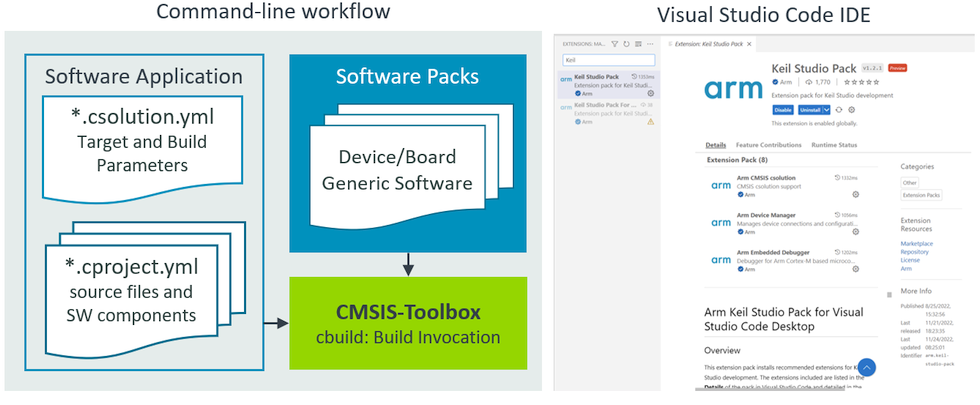

# CMSIS-Toolbox {#mainpage}

The **CMSIS-Toolbox** is developed as part of the [Open-CMSIS-Pack](https://www.open-cmsis-pack.org/) project in collaboration with Arm, NXP, and STMicroelectronics. It is an integral part of next generation software tools and unifies development flows with popular embedded toolchains (Arm, GCC, IAR, and LLVM compiler).

The CMSIS-Toolbox provides command-line tools for:

 - Project creation and build of embedded applications utilizing [Software Packs](https://www.keil.arm.com/packs/) with support for multiple compilation tools.
 - Software Pack creation, maintenance, and distribution utilizing the [CMSIS-Pack format](https://open-cmsis-pack.github.io/Open-CMSIS-Pack-Spec/main/html/index.html).

## Access to CMSIS-Toolbox

CMSIS-Toolbox is actively maintained in a dedicated GitHub repository and released as a set of binary utilities.

 - [**CMSIS-Toolbox User Guide**](https://github.com/Open-CMSIS-Pack/cmsis-toolbox/blob/main/docs/README.md) - provides user documentation for the CMSIS-Toolbox.
 - [**CMSIS-Toolbox Artifacts**](https://artifacts.keil.arm.com/cmsis-toolbox/) - pre-built utilities for integration into IDEs and CI workflows.
 - [**CMSIS-Toolbox GitHub Repo**](https://github.com/Open-CMSIS-Pack/cmsis-toolbox) - contains the source code and releases.

## Overall Workflow

The CMSIS-Toolbox uses [Software Packs](https://www.keil.arm.com/packs/) for device/board support and access reusable software components.

The overall operation is controlled with intuitive [User Input files in YAML format](https://github.com/ReinhardKeil/cmsis-toolbox/blob/main/docs/YML-Input-Format.md). The application is defined in the `*.csolution.yml` file and contains one or more projects that can utilize pre-configured software layers. The build engine CMake/Ninja calls the C/C++ compiler toolchain that generates the Build Output.

The `cbuild` command orchestrates the overall build process and calls individual command line tools to generate the target application binary image or library.

## Key Features and Benefits

 - Flexible CLI tools that can be used stand-alone or integrated into [VS Code](https://marketplace.visualstudio.com/items?itemName=Arm.keil-studio-pack) or DevOps systems for Continuous Integration (CI).
 - Stand-alone tools that are available for all host platforms (Windows, Mac, Linux) and flexible deployable.
 - Support for multiple toolchains (Arm, GCC, IAR, and LLVM compiler), even within the same set of project files and command line options to select different toolchains during verification.
 - [Software Packs](https://www.keil.arm.com/packs/) simplify tool setup with `device:` or `board:` selection and project creation with access to reusable software components.
 - Organize solutions with projects that are independently managed simplifies a wide range of use cases including multi-processor applications or unit testing.
 - Provisions for product lifecycle management (PLM) with versioned software packs that are easy to update and management for configuration files.
 - Software layers enable code reuse across similar applications with a pre-configured set of source files and software components.
 - Multiple hardware targets allow application deployment to different hardware (test board, production hardware, virtual hardware, etc.).
 - Multiple build types support software testing and verification (debug build, test build, release build, ect.).
 - Linker Script Management utilizes device and board information to define the available memory and allows flexible control of the linker operation.
 - Uses a CMake backend for the build process that integrates with other tools such as VS Code intellisense.
