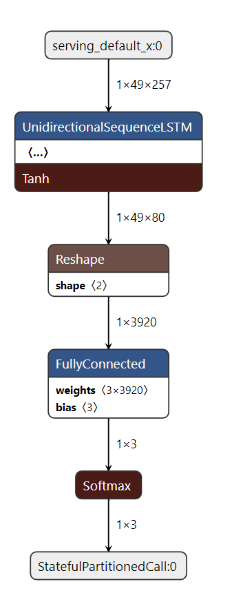
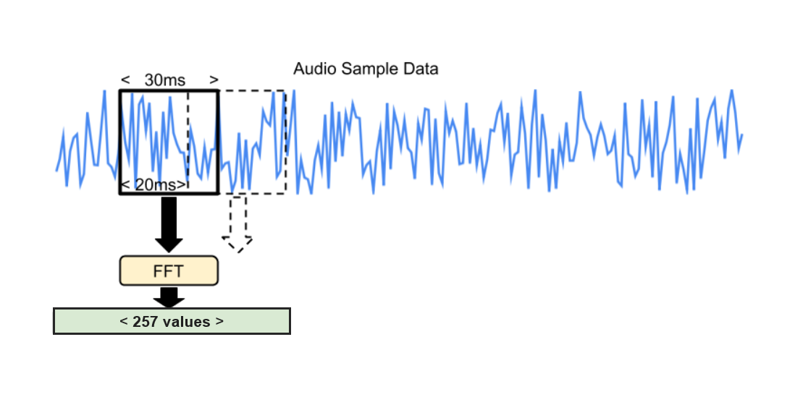

# Mini Speech Training with LSTM

This example shows how to train a 125 kB model that can recognize any of 2 keywords from the below 8 keywords chosen by the user,
classify all other commands as an "unknown" keyword, and predict the chosen keywords from speech data.

You can retrain it to recognize any combination of words (2 or more) from this
list (all other words would be passed to "unknown" keyword set):

```
"down", "go", "left", "no", "right", "stop", "up" and "yes".
```

The scripts used in training the model have been sourced from the
[Simple Audio Recognition](https://www.tensorflow.org/tutorials/audio/simple_audio)
tutorial.

## Table of contents

-   [Overview](#overview)
-   [Training](#training)
-   [Trained Models](#trained-models)
-   [Model Architecture](#model-architecture)
-   [Dataset](#dataset)
-   [Preprocessing Speech Input](#preprocessing-speech-input)


## Overview

1.  Dataset: [Mini Speech Commands](http://storage.googleapis.com/download.tensorflow.org/data/mini_speech_commands.zip)
2.  Dataset Type: **Mini_Speech_Commands**
3.  Deep Learning Framework: **TensorFlow 2.5.0**
4.  Language: **Python 3.7**
5.  Model Size: **<125 kB**
6.  Model Category: **Multiclass Classification**

## Training

Train the model in the cloud using Google Colaboratory.

<table class="tfo-notebook-buttons" align="left">
  <td>
    <a target="_blank" href="https://colab.research.google.com/github/tensorflow/tflite-micro/blob/main/third_party/xtensa/examples/micro_speech_lstm/train/micro_speech_with_lstm_op.ipynb">Google Colaboratory</a>
  </td>
</table>

*Estimated Training Time: ~2 Minutes.*

##


## Trained Models

The flatbuffer model generated as a result of the traning can be found
[here](../micro_speech_lstm.tflite). This model is quantized to int8 precision,
i.e. all the activations and weights are int8.

## Model Architecture

This is a simple model comprising of a Unidirectional Sequence LSTM layer, a
Reshape layer, a Fully Connected Layer or a MatMul Layer (output: logits) and a
Softmax layer (output: probabilities) as shown below. Refer to the below model
architecture.



*This image was derived from visualizing the 'micro_speech_model.tflite' file in
[Netron](https://github.com/lutzroeder/netron)*

This produces a model with an accuracy of ~93%, but it's designed to be used as
the first stage of a pipeline, running on a low-energy piece of hardware that
can always be on, and then wake higher-power chips when a possible utterance has
been found, so that more accurate analysis can be done. Additionally, the model
takes in preprocessed speech input as a result of which we can leverage a
simpler model for accurate results.

## Dataset

The [Mini Speech Commands Dataset](http://storage.googleapis.com/download.tensorflow.org/data/mini_speech_commands.zip)
consists of over 8,000 WAVE audio files of people saying 8 different words. This
data was collected by Google and released under a CC BY license. You can help
improve it by contributing five minutes of your own voice. The archive is over
2GB, so this part may take a while, but you should see progress logs, and once
it's been downloaded you won't need to do this again.

## Preprocessing Speech Input

In this section we discuss spectrograms, the preprocessed speech input to the
model. Here's an illustration of the process:



The model doesn't take in raw audio sample data, instead it works with
spectrograms which are two dimensional arrays that are made up of slices of
frequency information, each taken from a different time window.

The recipe for creating the spectrogram data is that each frequency slice is
created by running an FFT across a 30ms section of the audio sample data. The
input samples are treated as being between -1 and +1 as real values (encoded as
-32,768 and 32,767 in 16-bit signed integer samples).

This results in an FFT with 257 entries.

In a complete application these spectrograms would be calculated at runtime from
microphone inputs, but the code for doing that is not yet included in this
sample code. The test uses spectrograms that have been pre-calculated from
one-second WAV files.
